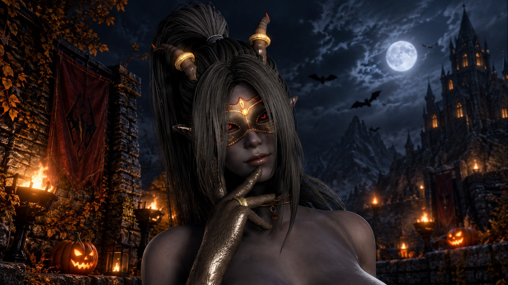

# Tinesh's Hollow Lantern - A CBBE 3BA Halloween Outfit for Skyrim SE/AE

An original Halloween outfit for Skyrim Special Edition and Anniversary Edition: a lantern witch with a touch of the
demon, in black leather, burnt-orange wool and brass. The set has eleven items, from a corset with attached briefs and
over-knee heeled boots to a leather masquerade mask, two enchanted lantern axes and a carved pumpkin lantern that
lights the way. It is made for CBBE 3BA with full BodySlide support, and an optional pack of five body presets comes
with it.



**[Download the latest release](https://github.com/71Kevin/hollow-lantern-se/releases/latest)**: 2K, 4K and 8K
packages and the optional body presets, see [Downloads](#downloads).

## Features

- **Eleven items**: corset with attached briefs, shorts, over-knee boots with a Louis heel, opera gloves, choker with
  a pumpkin charm, horns, masquerade mask, tail, war axe, battleaxe and a carried jack-o'-lantern.
- **Made for CBBE 3BA**: every 3BA slider, a BodySlide group with one project per body piece and Build Morphs
  support. Bone weights come from the body, so the pieces follow the breast, butt and thigh physics.
- **Checked for clipping** on 13 body presets at low and high weight, and in motion poses (walking, long strides,
  legs apart and together, crouching, sitting, head turns and nods).
- **Masquerade mask**: black leather with orange stitching, brass eye frames, glowing pumpkin-vine inlays and a
  brass pumpkin medallion. It fits human, elf and orc faces and leaves the mouth and chin free.
- **Lantern axes**: a one-handed war axe and a two-handed battleaxe in blackened steel and orange, with a glowing
  ember edge, amber lantern windows and their own enchantment, **Hollow Lantern Ember**.
- **Jack-o'-lantern**: carried in the left hand like a torch, with a flickering flame and a warm light that never
  burns out.
- **Tail physics**: the tail swings with SMP physics and collides with the body.
- **Simple crafting**: every item is made at any blacksmith forge, no perk needed.
- **Three texture packages**: 2K, 4K and 8K, see [Texture options](#texture-options).
- ESL-flagged plugin that only adds new records; the only master is `Skyrim.esm`.

## Downloads

Install **one** outfit package. All three contain the same plugin, meshes and BodySlide files; only the texture size
changes. The body presets are a separate, optional download.

| Package | Textures | Download (version 1.0) |
|---|---|---|
| Outfit, 2K | 2048 px | [Hollow-Lantern-CBBE-3BA-2K-1.0.7z](https://github.com/71Kevin/hollow-lantern-se/releases/download/v1.0/Hollow-Lantern-CBBE-3BA-2K-1.0.7z) (57.3 MB) |
| Outfit, 4K | 4096 px | [Hollow-Lantern-CBBE-3BA-4K-1.0.7z](https://github.com/71Kevin/hollow-lantern-se/releases/download/v1.0/Hollow-Lantern-CBBE-3BA-4K-1.0.7z) (72.5 MB) |
| Outfit, 8K | 8192 px | [Hollow-Lantern-CBBE-3BA-8K-1.0.7z](https://github.com/71Kevin/hollow-lantern-se/releases/download/v1.0/Hollow-Lantern-CBBE-3BA-8K-1.0.7z) (128.9 MB) |
| Body presets (optional) | — | [Hollow-Lantern-Body-Presets-CBBE-3BA-1.0.7z](https://github.com/71Kevin/hollow-lantern-se/releases/download/v1.0/Hollow-Lantern-Body-Presets-CBBE-3BA-1.0.7z) (2.3 KB) |

Release notes and SHA-256 checksums: [v1.0](https://github.com/71Kevin/hollow-lantern-se/releases/tag/v1.0).

### Texture options

The whole outfit shares one texture atlas: a diffuse map and a normal map with specular in the alpha channel, plus a
smaller glow map (mask, axes and lantern) and reflection mask (brass and steel). The package names give the real size
of the atlas:

| Package | Diffuse and normal map | Glow map and reflection mask |
|---|---|---|
| 2K | 2048 × 2048 px | 512 × 512 px |
| 4K | 4096 × 4096 px | 1024 × 1024 px |
| 8K | 8192 × 8192 px | 2048 × 2048 px |

The atlas was painted at 8192 px and the 4K and 2K sets are reduced from it, so all three look the same apart from the
amount of detail. All textures are BC7 with full mipmaps.

### Mod pages

| Page | Hollow Lantern | Hollow Lantern Body Presets |
|---|---|---|
| GitHub | [Releases](https://github.com/71Kevin/hollow-lantern-se/releases) | [Releases](https://github.com/71Kevin/hollow-lantern-se/releases) (same release) |
| Nexus Mods | Coming soon | Coming soon |
| Dwemer Mods | Coming soon | Coming soon |

## Requirements

- Skyrim Special Edition or Anniversary Edition. Built and tested on version 1.6.1170.
- [CBBE 3BA (3BBB)](https://www.nexusmods.com/skyrimspecialedition/mods/30174) and its requirements (CBBE, XP32
  Maximum Skeleton Special Extended, CBPC).
- [BodySlide and Outfit Studio](https://www.nexusmods.com/skyrimspecialedition/mods/201), to build the outfit for
  your body preset.
- Recommended: [RaceMenu](https://www.nexusmods.com/skyrimspecialedition/mods/19080) for the heel height of the boots
  and for BodyMorph, and [FSMP - Faster HDT-SMP](https://www.nexusmods.com/skyrimspecialedition/mods/57339) for the
  tail physics (without it the tail hangs still).

No DLC is needed. The plugin has no scripts of its own and does not need SKSE; CBBE 3BA, RaceMenu and FSMP do.

## Installation

1. Install **one** outfit package with your mod manager:
   - **Mod Organizer 2**: *Install a new mod from an archive* and pick the package.
   - **Vortex**: drag the package onto the *Mods* page (or use *Install From File*), then enable and deploy.
   - **Manual**: extract the package into the game's `Data` folder.
2. In BodySlide, pick the group **Hollow Lantern**, choose your CBBE 3BA preset, tick **Build Morphs** and run
   **Batch Build**. Without this step the pieces keep the default CBBE 3BA shape. The mask, horns, axes and lantern do
   not need BodySlide.
3. Enable `[Tinesh] Hollow Lantern.esp`. It is ESL-flagged and only adds new records, so its place in the load order
   does not matter.

The archive holds the `Data` folder's contents (plugin, `meshes`, `textures`, `CalienteTools`), so mod managers
install it without asking for a data folder. To switch texture packages, uninstall one and install the other, then
run Batch Build again.

## Getting the items

| Item | Slot / type | Armor / damage | Weight | Value | Forge recipe (no perk) |
|---|---|---|---|---|---|
| Hollow Lantern Corset | 32 (body), light armor | 20 | 3 | 180 | 3 Leather, 2 Leather Strips, 1 Iron Ingot |
| Hollow Lantern Shorts | 49, clothing | — | 1 | 55 | 1 Leather, 2 Linen Wrap, 1 Iron Ingot |
| Hollow Lantern Boots | 37 (feet), light armor | 7 | 1.5 | 70 | 2 Leather, 2 Leather Strips, 1 Iron Ingot |
| Hollow Lantern Gloves | 33 (hands), light armor | 6 | 0.5 | 45 | 1 Leather, 1 Leather Strips |
| Hollow Lantern Choker | 45 (necklace), clothing | — | 0.2 | 40 | 1 Leather Strips, 1 Iron Ingot |
| Hollow Lantern Horns | 42 (circlet), clothing | — | 0.5 | 55 | 2 Bone Meal, 1 Leather Strips, 1 Iron Ingot |
| Hollow Lantern Mask | 44 (face), clothing | — | 0.5 | 75 | 1 Leather, 1 Leather Strips, 1 Gold Ingot |
| Hollow Lantern Tail | 40 (tail), clothing | — | 0.5 | 40 | 1 Leather, 1 Leather Strips |
| Hollow Lantern War Axe | one-handed axe | 14 | 13 | 650 | 3 Steel Ingot, 1 Gold Ingot, 2 Leather Strips, 1 Fire Salts, 1 Common Soul Gem |
| Hollow Lantern Battleaxe | two-handed axe | 24 | 22 | 980 | 5 Steel Ingot, 1 Gold Ingot, 3 Leather Strips, 2 Fire Salts, 1 Common Soul Gem |
| Hollow Lantern | carried light | — | 1.5 | 35 | 1 Gourd, 1 Torchbug Thorax, 1 Iron Ingot |

Base values; the inventory shows them with your perks applied. The corset, boots and gloves are tempered at a
workbench with 1 Leather Strips and the axes at a grindstone with 1 Steel Ingot (enchanted items need the Arcane
Blacksmith perk, as usual). The choker takes necklace enchantments and the horns circlet enchantments. Console:
`help "hollow lantern" 4`, then `player.additem <ID> 1`.

### Enchantment: Hollow Lantern Ember

Both axes carry it, stronger on the battleaxe. While it has charge, the blade glows with a pulsing ember shader;
recharge it with soul gems. It cannot be learned by disenchanting.

| Effect | War Axe | Battleaxe |
|---|---|---|
| Lantern Ember: fire damage on hit | 18 | 26 |
| Lantern Burn: fire damage per second for 4 seconds, does not stack | 4 | 6 |
| Lantern's Hunger: soul trap | 10 s | 10 s |
| Lantern's Dread: targets below 35% health flee, up to level | 35, for 8 s | 45, for 10 s |
| Charge / cost per hit | 2500 / 60 | 3000 / 85 |

Fire resistance reduces both fire effects. Lantern's Dread only works on wounded targets, so it ends fights instead of
scattering fresh enemies.

## Body presets

**Hollow Lantern Body Presets** is a separate, optional package with five CBBE 3BA BodySlide presets made to wear
this outfit. They work with any CBBE 3BA outfit, and the outfit does not need them.

| Preset | Shape |
|---|---|
| Hollow Lantern - Harvest Queen | Voluptuous: very full bust, soft waist, wide hips, heavy thighs and a round butt |
| Hollow Lantern - Tavern Witch | Soft curves: full bust that grows with weight, rounded belly and hips |
| Hollow Lantern - Night Huntress | Athletic: defined abs, high round butt, strong thighs and calves |
| Hollow Lantern - Wisp Dancer | Full bust over a narrow waist, wide hips and toned legs |
| Hollow Lantern - Ember Warden | Strong and muscular: broad shoulders, defined abs and arms; lean at low weight |

Curvy presets often push the body through itself at the cleavage and between the thighs, and garments copy that. In
these presets the breasts never cross the middle of the cleavage and the inner thighs never overlap, at both
weights, so outfits clip less there.

Install the package with your mod manager (it only adds `CalienteTools\BodySlide\SliderPresets\Hollow Lantern
Presets.xml`), pick the preset in BodySlide (groups CBBE, 3BA, 3BBB, CBBE Bodies and Hollow Lantern), build the body
and run Batch Build for your outfits. There is no plugin. More in [presets/README.md](presets/README.md).

## Compatibility

- Adds new records only and changes no vanilla record.
- Female characters only: on male characters the pieces show nothing.
- Pieces that share a slot with other items replace them (see the table above for the slots).
- The mask is made for human, elf and orc heads, vanilla and High Poly Head; Khajiit and Argonian heads are not
  supported. Long bangs can cover it, and the horns can intersect voluminous hairstyles.
- On beast races the tail replaces the character's own tail (both use slot 40).
- The shorts are not cloth-simulated: they bend with the hips and thighs, and deep sitting poses crease them at the
  hips.
- The meshes are detailed (about 300,000 triangles for the worn set, 39,000 and 60,000 for the axes): fine for the
  player and followers, heavy for crowds of NPCs.

## How it was made

Everything was modelled, rigged and textured from scratch with scripts: Blender with PyNifly for the meshes, Python
for the fitting and the texture painting, and Mutagen for the plugin. No mesh or texture comes from another mod; the
corset carries the CBBE 3BA body, as body-slot outfits do.

- **Fitting**: the close-fitting pieces are draped over a smoothed copy of the CBBE 3BA body, cut along curves and
  given thickness, an inner lining and rounded edges. Bone weights and every 3BA slider are transferred from the body.
- **Clipping**: the skin under the corset and briefs is trimmed, and the skin left near the corset edges was checked
  against 108 BodySlide presets so it stays under the leather.
- **Mask**: shaped over eight head variants (vanilla and High Poly Head; Nord, Orc and High Elf race shapes; face
  sliders and expressions) with clearance to spare.
- **Textures**: painted procedurally in the atlas (leather grain, wool, stitching along every seam, brass, blackened
  steel and glowing inlays) with ambient occlusion baked from the meshes.

## Building from source

The repository holds the build pipeline; the release packages are built from it. `build.ps1` builds the three outfit
packages and `presets\build.ps1` the body presets.

1. Install the mods the build reads its references from in a Mod Organizer 2 mods folder: CBBE, CBBE 3BA (3BBB),
   XP32 Maximum Skeleton Special Extended, and the heads used to shape the mask (Expressive Facegen Morphs and High
   Poly Head). Their folder names are set at the top of `tools/extract_refs.py`, `tools/hl_face.py` and
   `tools/piece_horns.py`.
2. Install the tools: Blender 4.3 with PyNifly, Python 3 with NumPy, OpenCV and lz4, texconv (DirectXTex), the .NET 9
   SDK and 7-Zip.
3. Run the builds from PowerShell:

   ```powershell
   .\build.ps1                     # the 2K, 4K and 8K packages in dist\
   .\build.ps1 -Install            # also installs the 8K package into the Mod Organizer 2 mod folder (MO2 closed)
   .\presets\build.ps1             # the body presets package in dist\
   ```

   Tool and folder locations are parameters (`-Mods`, `-Game`, `-Blender`, `-SevenZip`, `-ModFolder`). Reference
   data and texture sources are kept in `cache\` and reused.

| Path | Contents |
|---|---|
| `build.ps1` | One-command build: references, meshes, textures, plugin and packages |
| `tools/build_meshes.py` | Meshes, BodySlide projects, tail physics and ground models (Blender + PyNifly) |
| `tools/piece_*.py` | One script per item |
| `tools/hl_*.py` | Shared helpers: fitting, slider data, BodySlide files, NIF export, texture atlas, head morphs |
| `tools/make_textures.py` | Texture atlas painting and the three BC7 texture sets |
| `tools/extract_refs.py` | Reads the CBBE 3BA reference body, hands, feet, sliders and skeleton |
| `tools/lib/` | NIF helpers for static meshes and collision, BSA reader |
| `plugin/` | Plugin generator (C#, Mutagen) |
| `presets/` | Body presets: fitting script, build and README |
| `docs/` | Screenshot and the release checklist |

## Credits and permissions

- **Tinesh**: design, meshes, textures, plugin and body presets.
- **CBBE** by Ousnius, Caliente and Jeir, and **CBBE 3BA** by Acro: the corset carries the CBBE 3BA body mesh and its
  BodySlide sliders.
- **Bethesda Game Studios**: the vanilla effects, cubemaps, first-person body and soul trap script the items use
  (referenced, not included).
- Tools: Blender, PyNifly, Mutagen, DirectXTex, 7-Zip.

## Support My Work

If you enjoy my mods and want to support future projects, you can buy me a coffee on Ko-fi:
[**Support me on Ko-fi**](https://ko-fi.com/tinesh)
